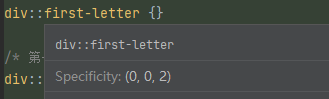

## CSS

### CSS编写位置

1. 行内样式，写在标签内
2. 内部样式，写在 head 里
3. 外部样式，单独一个文件，好处是利于浏览器缓存

优先级规则：行内样式 > 内部样式 = 外部样式

内部、外部样式，后面的会覆盖前面的，有代码的先后顺序决定

### CSS选择器

#### 基本选择器

基本选择器包括: 通配选择器, 元素选择器, 类选择器, id选择器

##### 通配选择器

可以选中所有 `HTML` 元素
```css
* {
    color: orange;
}
```

##### 元素选择器

为页面中某种元素统一设置样式, 元素选择器无法实现差异化设置, 所有 h1 标签效果都一样
```css
h1 {
    color: orange;
}
```

##### 类选择器

根据 class 值,选中某些元素,class 翻译有 种类, 类别的含义,所以 class 值又称为 类名

1. class 的值按照标准,不能使用纯数字,不要使用中文,多个单词组成用 - 连接,例如 left-menu
2. 一个元素不能写多个 class 属性,后写的会被忽略
3. 一个元素的 class 能写多个值,用空格隔开

```html
<h1 class="left-menu speak"></h1>
```
```css
.left-menu {
    color: rosybrown;
}
.speak {
    color: rebeccapurple;
}
```

##### ID选择器

根据元素的 id 的值,来精准选中某个值

1. id 属性值,尽量由 字母,数字, 下划线, 短杠 组成,最后以字母开头, 不要包含空格,区分大小写
2. 一个元素只能拥有一个 id 属性,多个元素的 id 属性值不能相同
3. 一个元素可以同时拥有 id 和 class 属性

```html
<h1 id="earthy"></h1>
```
```css
#earthy {
    color: rosybrown;
}
```

#### 复合选择器

##### 交集选择器

作用:选中同时符合多个条件的元素

语法: 选择器1选择器2选择器3...{} (紧紧的贴在一起)

1. 由标签名,标签名必须写在前面
2. id 选择器,理论上可以作为交集,但是实际一般不这么干
3. 交集选择器中,不可能出现两个元素选择器,因为一个元素,不可能即使 p标签,又是 span标签
4. 用的最多的交集选择器是 元素选择器配合类名选择器,例如下面第一个案例

同时符合 为p标签,且类为 speak 的元素, 标签必须写在最前面

```css
p.speak{ }
```

同时满足 p 标签,类为 speak 且 id为 wc的选择器 (一般没人这样干)
```css
p.speak#wc { }
```

##### 并集选择器

选中多个选择器对应的元素，又称 分组选择器，这里有 或 的意思

语法：选择器1,选择器2,选择器3....选择器n {}

这里的逗号就是或的意思

1. 并集选择器,我们一般竖着写看案例
2. 任何形式选择器,都可以作为并集选择器的一部分
3. 并集选择器通常用于集体声明,可以缩小样式表体积

```css
.cl1,
.cl2,
.cl3,
#id { }
```

##### 后代选择器

选中指定元素中,符合要求的后代元素

语法 选择器1 选择器2 选择器3 ... 选择器n {} ,选择器之间用空格隔开

1. 后代选择器,最终选择的是后代,不选中祖先
2. 儿子, 孙子, 重孙子 都属于后代
3. 结构一定符合 HTML 嵌套要求, 例如 p 中 不能写 h1 - h6

```css
ul li {}

.subject li {}
```

##### 子代选择器

选中指定元素中,符合 子元素(儿子元素)

语法: 选择器1>选择器2>选择器3>...选择器{}

1. 子代选择器,最终选中的是子代,不是父级
2. 子, 孙子, 重孙子 统称后代,子 就算指 儿子(1代)

```css
div > a {}
div>a {}
#id>a{}
```

##### 兄弟选择器

相邻兄弟选择器: 符合条件的相邻兄弟元素

语法: 选择器1+选择器2 {}

通用兄弟选择器: 选中指定元素后,符合条件的所有兄弟元素

语法: 选择器1~选择器2 {}

```css
/* 选中 div 紧紧相邻的兄弟p元素 相邻兄弟选择器*/
dip+p {}

/* 选中div后所有的兄弟p元素 通用兄弟选择器 */
div~p {}
```

场景: 排除第一个 li 后续所有的 li 都选中
```css
li~li {}

li+li {}
```

##### 属性选择器

语法

1. [属性名] 选中具有某个属性的元素
2. [属性名="值"] 选中包含某个属性,且属性值 等于 指定元素
3. [属性名^="值"] 选中包含某个属性,且属性值 以值开头 指定元素
4. [属性名$="值"] 选中包含某个属性,且属性值 以值结尾 指定元素
5. [属性名*="值"] 选中包含某个属性,且属性值 包含值 指定元素

```html
<p title="speak"></p>
```

```css
[title] {}
[title="speak"] {}
[title^="s"] {}
```

##### 伪类

作用:选中特殊状态的元素

**动态伪类**

1. `:link` 超链接未被访问的状态 只能用于 a 标签
2. `:visited` 超链接被访问的状态 只能用于 a 标签
3. `:hover` 鼠标悬浮在元素上的状态
4. `:active` 元素被激活的状态
5. `:focus` 获取焦点的元素

前四类是有顺序的,按 link, visited, hover, active 来,否则会导致前面写的失效 记忆方式 lvha (LV好)

```css
/* 选中的是没有访问过的 a 元素 */
a:link {}

/* 选中的是访问过的的 a 元素 */
a:visited {}

/* 选中的是鼠标悬浮状态的 a 元素 */
a:hover {}

/* 选中的是激活状态的 a 元素 */
a:active {}

/* 获取焦点时, focus 只有表单才有*/
input:focus {}
select:focus {}
```

###### **结构伪类**

1. `:nth-last-child(n)` 所有兄弟元素中的倒数第n个
2. `:nth-last-of-type(n)` 所有同类型兄弟元素中的 倒数第n个
3. `:only-child` 选择没有兄弟的元素(独生子女)
4. `:only-of-type` 选择没有同类型兄弟的元素
5. `:root` 根元素
6. `:empty` 内容为空元素(空格也算)

选中的是 div 的第一个儿子 p 元素(按照所有兄弟计算)
```css
div>p:first-child {}
```

选中的是 div 的最后一个儿子 p 元素(按照所有兄弟计算)
```css
div>p:last-child {}
```

选中的是div的第 n 个儿子p元素, 关于 n 的值 (按照所有兄弟计算)
1. 0 或 不写,什么都不选中,几乎不用
2. n: 选中所有子元素 几乎不用
3. 1 ~ 正无穷 的整数, 选中对应序号的子元素
4. 2n 或 even : 选中序号为偶数的子元素
5. 2n + 1 或 odd: 选中序号为奇数的子元素
6. -n + 3 : 选中前三个
```css
div>p:nth-child(3) {}
```

选中的是 div 的第一个儿子 p 元素,按照所有同类型兄弟计算的 
```css
div>p:first-of-type {}

div>p:last-of-type {}

/* 选中的是第 n 个儿子p元素 按照所有同类型兄弟计算 */
div>p:nth-of-type(5){}
```

选中的是没有兄弟的 span 元素
```css
span:only-child {}
```

选中的是 没有同类型兄弟的 span 元素
```css
span:only-of-type {}
```

选中的是没有内容的 div 元素
```css
div:empty {}
```

###### **否定伪类**

选中的是 div 儿子p元素,但是排除类名为 fail 的元素

`:not(选择器)` 排除满足括号中条件的元素 

```css
div>p:not(.fail) {}

/* 排除了 title 属性值为 total 的*/
div>p:not([title^="total"]) {}

/* 排除了第一个 */
div>p:not(:first-child) {}
```

###### **UI伪类**

选中的是勾选的复选框 或单选按钮, 这类复选框, 单选框 无法更改颜色, 背景色

1. `:checked` 被选中的复选框或单选按钮
2. `:enable` 可用的表单元素, 没有 disabled 属性
3. `:disabled` 不可用的表单元素, 有 disabled 属性

```css
input:checked {}
```

选中的是被禁用, 可用的 input 元素

```css
input:disabled {}

input:enabled {}
```

###### **目标伪类**

`:target` 选中锚点指向的元素

###### **语言伪类**

`:lang()` 根据指定的语言选中元素 (本质是看 lang 属性的值)

###### **伪元素选择器**

选中的是 div 中的第一个字符

```css
/* 第一个字符 */
div::first-letter {}

/* 第一行 */
div::first-line

/* 选中的是被鼠标选中的文字 */
div::selection {}

/* 选中的是 input 元素中的提示文字 */
input::placeholder {}

/* 选中p 元素最开始的位置,随后创建一个子元素 */
p::before{
    content: "$";
}
```


#### 选择器优先级


>  行内 > ID选择器 > 类选择器 > 元素选择器 >  统配选择器


##### 选择器权重

格式(a,b,c)

a: ID选择器个数

b: 类, 伪类, 属性选择器的个数

c: 元素, 伪元素 选择器的个数	


先比较a, 再比较b,c 谁数量多谁胜出, 全重大,如果对比之后权重一样,就看顺序, 大部分IDE 都会算权重



 `!important;` 最牛权重: 比行内权重还要高

```css
.slogan{
    color: purple !important;
}
```


### CSS三大特性

层叠性: 如果发生了样式冲突, 那就会根据一定的规则(选择器优先级), 进行样式的层叠(覆盖)

继承性: 元素会自动拥有其父元素, 或祖先元素上所设置的某些样式, 优先继承离得近, 常见的继承属性: `test-??` , `font-??` , `line-??` , `color`...

优先级: `!import` > `行内样式` > `ID选择器` > `类选择器` > `元素选择器` > `通配选择器` > `继承样式`, 另外需要计算权重.


### CSS像素

单位: px


### CSS颜色

通过`color:red` 这种方式直接使用颜色,也可以通过查阅 [MDN](https://developer.mozilla.org/zh-CN/docs/Web/CSS/named-color) 查看还有哪些可用使用的单词.

表示形式

1. RBG: rgb(255,255,255) 分别代表 红, 绿, 蓝
2. RBGA: rgb(255,255,255,0.5) 增加最后一位透明度取值 0~1
3. HEX: `#ff00ff` 十六进制表示法,如果两两一致可以写成缩写版本,例如: `#aabbcc` 写成 `#abc`, 
4. HEXA: `#ff00ffff` 增加最后以为透明度, 也可以简写例如: #99886633 写成 #9863, 注意: **IE 浏览器不支持 HEAX**
5. HSL: hsl(0deg,100%,50%), 色相环,  分别代表色度数,饱和度,亮度 deg 可用省略 hsl(60,100%,50%)
6. HSLA:  加个透明度,可以写小数 也可以写百分号


### CSS字体属性

#### 字体大小

属性名: `font-size`

Chrome 浏览器最小支持 12px ,默认文字为 16px, 并且 0px 会自动消失, 为了适配在不同浏览器打开, 最好给一个明确的值,不要用默认值, 用到继承法

```css
body {
    font-size: 20px;
}
```

#### 字体族

属性名: `font-family`

1. 英文名字兼容性会更好
2. 可用设置多个,按照从左往右查找,找到就用,没找到就用后面的,最后一个都没用, windows 默认微软雅黑.
3. 通常在最后面加 serif(衬线字体) 或 sans-serif (非衬线字体). 他会使用计算机本地的衬线 , 非衬线字体使用.

```css
div {
    font-family: "SimSun","Microsoft YaHei",sans-serif;
}
```

#### 字体风格

属性名: `font-style`

常用值包括 normal 正常, italic 斜体, oblique 斜体

> 斜体: italic与oblique, 两者都是斜体, 但是只有 italic 是先获取字体是否有斜体设计,如果这个字体没有设计斜体字,就再强制倾斜. 工作中推荐 使用 `italic`
>
> 1. italic 使用字体自带的斜体效果
> 2. oblique 强制倾斜产生倾斜效果

之前使用 em 标签也可以使字体倾斜,不过那是为了语义化,让SEO爬虫知道这是一段重要内容

#### 字体粗细

属性名: `font-weight`

常用关键字有 lighter 细, normal 正常, bold 粗, bolder 很粗. 也可以写数值 100 - 1000 无单位, 通过数字控制, 数字越大越粗.

有时候即使调整了数字,字体也没有变化, 是因为字体设计的时候,没有设计那么多个粗细等级,可能就 2 或 3 个等级,

#### 字体复合属性

属性名: `font`
编写规则: 字体大小,字体族 必须写,而且分别是倒数第二,和倒数第一的位置,只有这两个写对,才会生效, 开发中更推荐这种写法. 如果要调整字体大小, 单独使用 `font-size` 就好了

```css
.media {
    font: bold italic 100px "SimSun","Microsoft YaHei",sans-serif;
}
```


### CSS文本属性

#### 文本颜色

```css
color: red;
```


#### 文本间距

字母间距： `letter-spacing`

单词间距：`word-spacing` （通过空格识别词）

属性值为像素（`px`），正值让间距增大，负值让间距缩小


#### 文本修饰

属性名：`text-decoration`

可选值：

1. `none`：无装饰线（常用）
2. `underline`：下划线（常用
3. `overline`：上划线
4. `line-through`：删除线

可以搭配使用：

1. `dotted` 虚线
2. `wavy`：波浪线
3. 也可以指定颜色

```css
a {text-decoration: none;}
div {text-decoration: underline wavy green;}
```


#### 文本缩进

属性名：`text-index` ，单位 px

```css
div { text-index: 40px }
```


#### 文本对齐-水平

属性：`text-align`

1. `left` 左对齐、默认值
2. `right` 右对齐
3. `center` 中间对齐


#### 文字对齐-垂直

顶部：无需任何属性，在垂直方向上，默认就是顶部对齐

居中：仅对于单行文字， hegiht =  line-hegiht 即可（多行文字往下看）

底部：仅对于单行文字，`line-height = height * 2 - font - size - x`


#### 文本大小-行高

属性：`line-height`

1. normal 由浏览器根据文字大小决定默认值
2. 像素 px
3. 数字，参考自身 `font-size` 到倍数 常用
4. 百分比，参考自身 `font-size` 百分比

> 建议设置为 font-size 的 <u>1.5 - 2.0</u> 倍之间
>
> 为啥建议些 数字呢？ 因为继承问题，如果直接写 像素，继承后代对不同的font-size 会有问题。


```css
.yun1 {
  font-size: 100px;
  /* 建议写到 1.5 - 2.0 之间 */
  /*line-height: 1.5;*/
  /*line-height: 150%;*/
  /*line-height: normal;*/
  line-height: 150px;
}
```


行高的应用场景：

1. 解决多行之间的间距

2. 解决单行文字的垂直居中问题 将

	```css
	#font {
	  height: 100px;
	  line-hegiht: 100px
	}
	```


注意事项：

1. `line-height` 过小，会导致文字产生重叠
2. `line-hegiht` 可以继承，未来更好呈现文字，最好写数值
3. `line-hegiht` 和 `hegiht` 的关系，如果设置了 `hegiht` 的值，那就是`hegiht`的值，如果不设置 `hegiht`，会根据 `line-hegiht` 计算高度


由于字体设计原因，文字最终呈现大小，并不一定与 font-size 的值一致，可能比 font-size大，也可能小，通常情况下，文字相对字体设计框，并不是居中垂直的，通常 <u>靠下</u> 一点。


#### vertical-align

属性名：vertical-align，用于指定同一行元素之间，或 表格单元格内文字的垂直对齐方式，注意此属性不能控制块元素。

1. baseline 使元素的基线与父元素的基线对齐
2. top 使元素的顶部与其所在行的顶部对齐
3. middle 使元素的中部与父元素的基线 加上父元素字母 x 的一半对齐
4. bottom 使元素的底部与所在行的底部对齐


### CSS列表属性

列表相关属性,可用作用在 ul, ol, li 元素上

1. `list-style-type` 设置列表符号
   1. `none `不显示(常用)
   2. `square` 实心方块
   3. `disc` 圆形
   4. `decimal` 数字 ....
2. `list-stype-position` 设置列表符号的位置
   1. `inside` 在 li 里面
   2. `outside` 在 li 外面
3. `list-style-image` 自定义符号,用法 url("图片地址")
4. `list-style` 复合属性,没有数量 顺序要求


### CSS表格属性

边框相关属性(其他元素也可以用)
1. `border-width` 边框宽度
2. `border-color` 边框颜色
3. `border-style` 边框风格
	1. `none` 默认值,没有线条
	2. `solid` 实线
	3. `dashed` 虚线
	4. `dotted` 圆点线
	5. `double` 双实线
4. `border` 复合属性,没有数量, 顺序需求


##### 表格独有属性

1. `table-layout` 设置列宽
	1. `auto` 自动,列宽根据内容计算
	2. `fixed` 固定列宽,平均分
2. `border-spacing` 单元格间距, 使用 css 长度值, 生效前提单元格不能合并
3. `border-collapse` 合并单元格, `collpse` 合并, `separete` 不合并
4. `empty-cells` 隐藏没有内容的单元隔, `show` 显示, `hide` 隐藏
5. `caption-side` 设置表格标题位置 `top` 上面, `bottom` 表格下面
以上 5个属性只有 `<table>` 标签可用

### CSS背景属性

1. `background-color` 背景颜色，默认颜色是 transparent 透明
2. `background-image` 背景图片，url(图片地址)
3. `background-repeat` 设置重复方式， `repeat`重复、`repeat-x` 只在水平重复、`repeat-y` 只在垂直重复、`no-repeat` 不重复
4. `background-position` 设置背景图位置
	1. 通过关键字 水平：`left`、`center`、`right` 垂直：`top`、`center`、`bottom`
	2. 通过长度指定位置  2个值，第一个x、第二个y 
5. `background` 复合属性，虽然没有数量顺序要求，如果不写颜色，默认 `transparent` 会把前面写的 `background-color` 覆盖掉

### CSS鼠标属性

属性名： `cursor` 设置鼠标光标样式
1. `pointer` 小手
2. `move` 移动光标
3. `text` 文字选择器
4. `crosshair` 十字架
5. `wati` 等待
6. `help` 帮助

```css
cursor: url("../../images/small.png"), pointer;
```

### 盒子模型

#### CSS长度单位

1. `px` 像素
2. `em` 相当于当前元素的 font-size 的倍数 当前没有 font-size 就往上找，兜底 16 px 浏览器默认
3. `rem` 相对于根 `<html>` 元素的 font-size 的倍数
4. `%` 相对父元素计算

如果不加单位，浏览器直接忽略这个属性


#### 元素的显示模式

块元素特点
1. 在页面独占一行，不会与任何其他元素共用一行，是从上到下排列的
2. 默认宽度，撑满父元素
3. 默认高度，由内容撑开
4. 可以通过 css 设置宽高

行内元素，又称内联元素
1. 在页面中不独占一行，一行中不能容纳下的行内元素，会在下一行继续从左到右排列
2. 默认宽度，由内容撑开，高度也是一样
3. 无法通过 CSS 设置高度

行内快元素，又称 内联块元素 **(兼具 块、行内特点，又是行内、又可以调整宽高)**
1. 在页面中 不独占一行，一行中不能容纳下的行内元素，会在下一行继续从左到右排列
2. 默认高度、宽度，由内容撑开
3. 可以通过 CSS 设置宽高，例如 img 标签

#### 各元素的显示模式

1. **块元素**
	1. 主体结构标签 `html`、`body`
	2. 排版标签：`h1` - `h6`、`hr`、`p`、`pre`、`div`
	3. 列表标签：`ul`、`ol`、`li`、`dl`、`dt`、`dd`
	4. 表格相关标签：`table`、`tbody`、`thead`、`tfoot`、`tr`、`caption`
	5. `form` 与 `option`
2. **行内元素**
	1. 文本标签：`br`、`em`、`strong`、`sup`、`sub`、`del`、`ins`
	2. `a` 与 `label`
3. **行内块元素**
	1. 图片 `img`
	2. 单元格 `td`、`th`
	3. 表单控件 `input`、`texterea`、`select`、`button`
	4. 框架标签 `iframe`

#### 修改元素显示模式

通过 css 中的 `display` 属性可以修改元素的默认显示模式，常用值如下

1. `none` 元素会被隐藏
2. `block` 元素将作为块级元素显示
3. `inline` 元素将作为内联元素显示
4. `inline-block` 元素将作为行内块元素显示

#### 盒子组成模型

`margin` 外边距、`border` 边框、`padding` 内边距、`content` 内容

#### 盒子内容区

`width` 宽度、`max-width` 最大宽度、`min-width `最小宽度
`height` 高度 .......

> 注意：max-width、min-width 一般不与 width 一起用， height 也是一样

#### 盒子内边距（padding）

1. `padding-top` 上边距
2. `padding-right` 右边距
3. `padding-bottom` 下边距
4. `padding-left `左边距，都是长度单位
5. `padding` 复合属性，可以设置 1-4 个值

padding 的使用规则，
1. 1个值， 四个方向都是这个值
2. 2个值，x y，上下x，左右y（上下、左右）
3. 3个值，x y z，上x，左右y，下z（上、左右、下）
4. 4个值，x y z p 上x，右y，下z，左p（上、右、下、左）
不能为负数，行内元素，左右内边距没问题，上下内边距不能够完美设置（字体问题）

#### 盒子边框

1. `border-style` 边框线条风格： `none` 默认值、`solid` 实线、`dashed` 虚线、`dotted` 点线、`double` 双实线
2. `border-width` 宽度，默认 3px
3. `border-color` 颜色，默认黑色
4. `border` 符合属性，相同的复合属性还有 `border-left`、`border-right`.... 这些又可以和前面三个相结合。

#### 盒子外边距 （margin）

注意事项：
1. 子元素 margin，是参考父元素的 content 计算的
2. 上 margin、左 margin 影响自己的位置，下 margin、右 margin 影响后面兄弟元素的位置
3. 块级元素、行内元素，均可以完美地设置四个方向的 margin，但行内元素，左右 margin 可以完美设置，上下 margin 设置无效
4. margin 的值也可以是 auto，会使当前块级元素水平居中
	```css
	h1{ margin: 0 auto;}
```
5. margin 的值可以是负数


#### margin塌陷问题
![[10_CSS盒子模型/03_margin塌陷问题.html]]

第一个子元素的 margin-top 会作用在 父元素上，最后一个子元素的 margin-bottom 会作用在父元素上
解决 margin 塌陷，在父元素上设置
1. `padding` 设置大于 0
2. `border` 也不为 0 ，可以设置为 `transparent`
3. 设置 `solid transparent`

#### margin合并问题
上面兄弟元素的下外边距和下面兄弟的上外边距合并，取一个最大的值，而不是相加，不需要解决，布局的时候，给一个设边距就好。


#### 处理内容溢出 (overflow)
1. `visible` 显示（默认）
2. `hidden` 隐藏
3. `scroll` 滚动条
4. `auto` 自动显示滚动条，内容溢出不显示

`overflow-x` 水平溢出处理方法，同 `overflow-y`，不过这两个是实验性属性，不建议使用，`overflow` 常用的是 `hidden` 和 `auto`

#### 隐藏元素的方式
1. visibility ，默认值是 show，设置为 hidden 会隐藏元素，元素看不见，但是还占着原来的位置
2. display，如果是在为 none ，既看不见，也不占位置

#### 样式继承

会继承的有：文字属性、文本属性（除了 vertical-algin）、文字颜色等
不会继承的有：边框、背景、内外边距、宽高、溢出方式等
> 一个规律，能继承的属性都是不影响布局的，加单的说，和盒子模型没关系

#### 元素默认样式

1. `a` 标签，下划线、字体颜色、鼠标小手
2. `h1` - `h6` 文字加粗、文字大小、上下外边距
3. `p` ，上下外边距
4. `ul`、`ol` 左内边距
5. `body` 元素，`8px` 外边距

#### 居中布局

只要给爹设置 `text-align: center;` 就可以让里面的行内元素居中

![[10_CSS盒子模型/05_布局作业.html]]


​```html
<div class="yun">  
    <div class="inner">Hello</div>  
</div>
```

```css
.yun {  
    width: 400px;  
    height: 400px;  
    background: gray;  
    overflow: hidden;  
}  
  
.inner {  
    width: 200px;  
    height: 200px;  
    background: orange;  
    margin: 100px auto 0;  
    text-align: center;  
    line-height: 200px;  
}
```

![[10_CSS盒子模型/06_布局作业.html]]

```html
<div class="yun">  
    <span class="inner">Hello</span>  
</div>
```

```css
.yun {  
    width: 400px;  
    height: 400px;  
    background: gray;  
    text-align: center;  
    line-height: 400px;  
}  
.inner {  
    font-size: 20px;  
    background: orange;  
}
```

![[10_CSS盒子模型/07_布局作业.html]]


```html
<div class="yun">  
    <div class="inner">  
        <span>Hello</span>  
          
    </div></div>
```

```css
.yun {  
    width: 400px;  
    height: 400px;  
    background: grey;  
    line-height: 400px;  
    text-align: center;  
    font-size: 0;  
}  
img {  
    width: 100px;  
    vertical-align: middle;  
}  
span {  
    font-size: 40px;  
    vertical-align: middle;  
    background: orange;  
}
```


行内元素、行内块元素，可以被父元素当文本处理

> 可以使用 text-align、line-height、text-indent 等

如何让子元素在父元素水平居中
1. 若子元素为快元素，给父元素加上 `margin: 0 auto;`
2. 若子元素为行内元素、行内块元素，给父元素加上 `text-align:center;`
如何让子元素，在父元素中垂直居中
1. 若子元素为快元素，给子元素加上 `margin-top`， 值为 `父元素 content - 子元素总高 / 2`
2. 若子元素为行内元素、行内块元素，让父元素的 `height = line-hegiht`，每个子元素都加上 vertical-align:middle; ，如果要绝对据居中，父元素需要设置 `font-size:0;`


#### 元素之间的空白问题

产生原因：行内元素、行内块元素，彼此之间的换行会被浏览器解析成一个空白字符
解决方案：
1. 去掉换行和空格（不推荐）
2. 给父元素设置 `font-size: 0px;` 里面的文字需要重新设置一下大小（推荐）

 #### 行内块的幽灵空白问题

行内元素与文本的基线对齐，而文本的基线与文本最底端之间有距离

解决方案
1. 给行内设置 `vertical` 不为 `baseline` 即可
```css
img {  
    vertical-align: top;
    vertical-align: middel;
    vertical-align: bottom;
}
```
2. 若父元素只有一张图片，图片设置为 `display: block;`
3. 给父元素设置 `font-size: 0;`

### 浮动

#### 浮动后特点

1. 脱离文档流 
2. 不管浮动前是什么元素，浮动后，默认的宽高都是被内容撑开，而且可以设置宽高
3. 不会独占一行，可以和其他元素共用一行
4. 不会 margin 合并，也不会 margin 塌陷，能够完美的设置四个方向的 margin、padding
5. 不会像行内块一样被当文本处理（没有行内块空白问题）

浮动的案例，见：


浮动后的影响
1. 对兄弟元素的影响,后面的兄弟,会占据浮动元素之前的位置
2. 对父元素的影响,不能支撑起父元素的高度,导致父元素高度塌陷

#### 解决浮动产生的影响

![[11_浮动/03_解决浮动后的影响.html]]


1. 方案一: 给父元素指定高度
2. 方案二: 父元素也浮动起来,带来更大的影响
3. 方案三: 给父元素设置 `overflow: hidden`
4. 方案四: 在所有浮动元素后面,添加一个**块元素**,并给找个块元素设置 `clear: both`
5. 方案五: 给浮动的父元素,通过伪选择器,清除浮动,原理和四一样 ,推荐这个方法
```css
.outer::after {  
    content: "";  
    display: block;  
    clear: both;  
}
```

> 布局中的原则, 这是浮动的时候,兄弟元素要么全都浮动,要么全都不浮动


#### 浮动案例


### 定位

#### 相对定位

用法：给元素设置 `position: relative` 即可实现相对定位，然后就可以使用 `left`、`right`、`top`、`bottom` 四个属性调整位置

相对定位参考的是自己原来的位置，特点有
1. 不会脱离文档流，元素位置的变化，只是视觉上的效果，不会对其他元素产生任何影响
2. 定位元素的显示层级比普通元素高，无论什么定位，显示层级都是一样的
	1. 默认规则是：1、定位的元素会覆盖在普通元素身上
	2. 2、都发生定位的两个元素，后写的元素会覆盖在先写的元素之上
3. `left` 不能和 `right` 一起设置，`top` 和 `bottom` 不能一起设置
4. 相对定位的元素，也能继续浮动，通过写 `float`，但是不建议这样做
5. 相对行为的元素，也可以通过 `margin` 调整位置，同样也不建议这样做。

```css
.box2 {  
    /* 相对定位，相对的是自己原来的位置 */    
    position: relative;  
    /* left 和 right 同时写， left 生效 */    
    left: 400px;  
}
```


#### 绝对定位

玩法：子绝父相（子元素开绝对定位、父元素开相对定位）
用法：给元素设置 position: absolute 即可实现绝对定位，然后就可以使用 `left`、`right`、`top`、`bottom` 四个属性调整位置

绝对定位参考它的包含块，包含块是：
1. 对于没有脱离文档流的元素：包含块就是父元素
2. 对于脱离文档的流元素：包含块就是一个拥有定位属性的祖先元素，如果所有祖先都没有定位，那包含块就是 `html` 元素

绝对定位特点
1. 脱离文档流，会对后面的兄弟元素、父元素有影响
2. `left` 不能和 `right` 一起设置，`top` 和 `bottom` 不能一起设置
3. 绝对定位、浮动不能同时设置，会使浮动失效，定位为主
4. 绝对定位属性，也能通过 margin 调整，但是不推荐
5. 无论什么元素（行内、行内块、块级）设置绝对定位后，都变成了定位元素，是一种全新的概念， 默认宽、高都被内容撑开，且能自由设置宽高

```css
.fa {
	position: relative;
}
.son {
	position: absolute;  
	top: 220px;  
	left: 20px;
}
```

#### 固定定位

适合接广子

给元素设置 position: fixed; 既可以实现固定定位，然后就可以使用 `left`、`right`、`top`、`bottom` 四个属性调整位置

固定定位参考它的 **视口**，其特点包含
1. 脱离文档流，会对后面的兄弟、父元素有影响
2. `left` 不能和 `right` 一起设置，`top` 和 `bottom` 不能一起设置
3. 固定定位和浮动不能同时设置，如果同时设置，浮动失效
4. 也可以用 `margin` ，但不推荐，和前面绝对定位一样，如果设置的是 `left`、`right` 就用 `margin-left` 和 `margin-right`
5. 会把元素变成定位元素

#### 粘性定位

属性名：`position: sticky;`  然后就可以使用 `left`、`right`、`top`、`bottom` 
离他最近的一个拥有滚动机制的祖先元素，即便这个元素不是真实可滚动的祖先

1. 不会脱离文档流，是一种专门用于窗口滚动的定位方式
2. 最常用的 `top` 值
3. 粘性定位和浮动可以同时设置，不推荐
4. 也可以通过 `margin` 调整，不推荐
5. 和定位特点基本一致，不同的是，粘性定位可以在元素达到某个位置固定住


#### 定位层级

属性名：z-index

1. 定位元素的显示层级比图片元素高，无论什么定位，显示层级都是一样的
2. 如果发生重叠，默认情况后面的元素会盖在前面的元素上
3. 通过 z-index 调整的元素，数值越高，层级越高，只有定位元素设置 z-index 才有效，如果 z-index 值大的元素依旧没有覆盖到 z-index 值小的元素，就检查其所在包层级（父级）是否设置了 z-index 且数值较小的原因。

#### 定位特殊应用

1. 发送固定定位，绝对定位之后，元素都变成了定位元素，默认高度被内容撑开，且依旧可以设置宽高。
2. 发生相对定位后，元素依旧是之前的显示模式
3. 以下所说的特殊应用，只针对 `绝对定位` 和 `固定定位` 元素，不包括相对定位的元素 

案例

```html
<div class="outer">  
    <div class="inner">Hello World</div>  
</div>
```

```css
.outer{  
    width: 800px;  
    height: 400px;  
    background: #888;  
    font-size: 20px;  
    /*overflow: hidden;*/  
    position: relative;  
}
```

```css
.inner {  
    width: 400px;  
    height: 100px;  
    background: orange;
}
```
方案一：不使用浮动
```css
margin: 0 auto;
margin-top: 150px;
```

方案二：先移动50%，再移回来一丢丢 (不是特别推荐)
```css
position: absolute;  
left: 50%;  
top: 50%;  
margin-left: -200px;  
margin-top: -50px;
```

方案三：四个角度方向都给0 然后 margin auto 居中
```css
position: absolute;  
top:0;  
bottom: 0;  
left: 0;  
right: 0;  
margin: auto;
```


注意：定位元素一定要有 宽、高


### 版心

1. 在 PC 端网页，一般会有一个固定宽度且水平居中的盒子，来显示网页主要内容，称之为版心
2. 版心的宽度一般是 960-1200 像素，随着时间可能逐渐变大
3. 版心可以是一个，也可以是多个


### 常见布局名词


| 位置        | 名词                         |
| --------- | -------------------------- |
| 顶部导航条     | `topbar`                   |
| 页头        | `header`、`page-header`     |
| 导航        | `nav`、`navigator`、`navbar` |
| 搜索框       | `search`、`search-box`      |
| 横幅、广告、宣传图 | `banner`                   |
| 主要内容      | `content`、`main`           |
| 侧边栏       | `aside`、`sidebar`          |
| 页脚        | `footer`、`page-footer`     |

### 重置默认样式

早期，默认样式能够让我们快速绘制网页，但是如今网页越来越复杂，导致默认样式在浏览器上呈现效果不一样，需要重置

#### 方案一：全局选择器
```css
* {
	margin: 0;
	padding: 0;...
{
```

实际开发不会用，a 标签不好调整吧，一棍打死所有属性

#### 方案二：reset.css

选择到具有默认样式的属性，清空其默认样式，经过 reset 后的网页，就像是一张白纸，再去设计

#### 方案三： Normalize.css

[Normalize.css 官网](https://necolas.github.io/normalize.css/)

最新的一种方案，清楚默认样式的同时，保留了一些有价值的默认样式

1. 保护有价值的默认样式，而不是完全去掉它们
2. 为大部分 HTML 元素提供一般化的样式
3. 新增对 HTML5 元素的设置
4. 对并集选择器的使用比较谨慎，有效避免调试工具杂乱

```
<link rel="stylesheet" href="https://necolas.github.io/normalize.css/8.0.1/normalize.css">
```